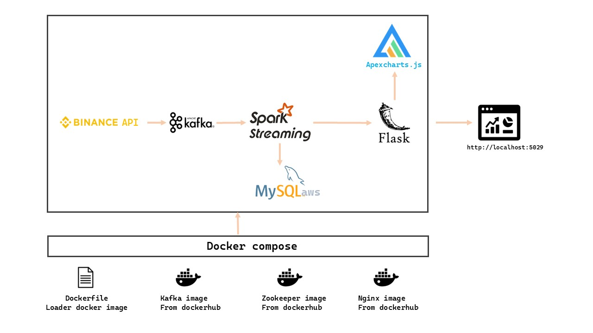
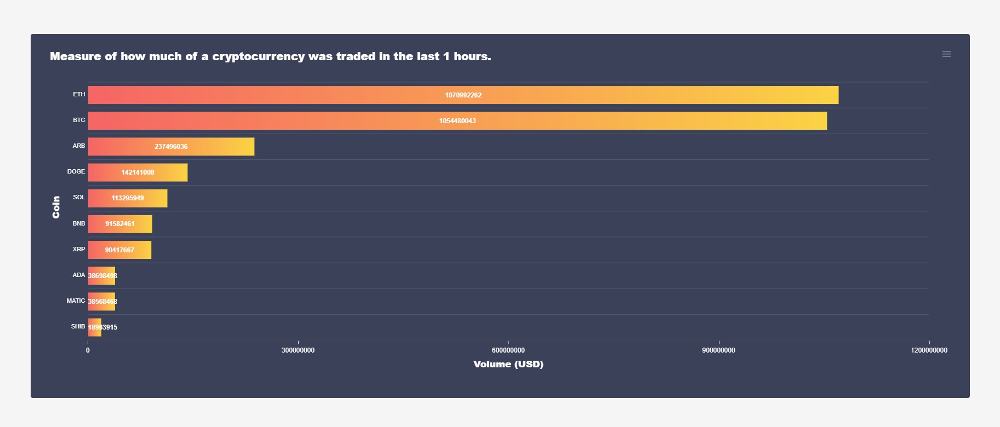

# Realtime-trending-coin-volumes-Binance
Statistics of coin’s volume in real time on Binance in the last 1 hour. Use Kafka to get data
from Binance API, then Spark Streaming reads data stream, process and send to Flask server to render
frontend. All log data is saved to mysql.

## Technology
frontend: ApexCharts.js 
backend: Python, Kafka, Spark, Mysql, BinanceAPI, Flask.



## Usage
Start docker-compose
```
docker-compose up --build
```
Server run at http://localhost:5029/ or in the domain set up in nginx(option).

## Demo


